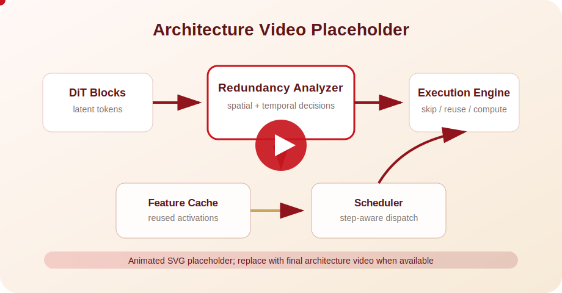

## Abstract

DSTAR accelerates Diffusion Transformers by reducing redundant computation across both spatial regions and denoising timesteps. The work targets the observation that DiT inference repeatedly processes similar information, and uses redundancy-aware execution to improve efficiency while preserving generated output quality.

## Overview

DSTAR focuses on efficient Diffusion Transformer inference. The core idea is to identify redundant computation from two directions: spatial redundancy across image or latent regions, and temporal redundancy across denoising steps. By avoiding unnecessary repeated work, the method aims to reduce inference cost while keeping generated results close to the original DiT pipeline.

## Framework

The placeholder above can be replaced by the final framework figure. A complete project page can later add the method pipeline, qualitative results, speedup comparison, and links to paper, code, slides, or video.

## Architecture

This animated placeholder can be replaced by the final architecture video. Use this section to describe the execution flow, hardware/software partitioning, data reuse strategy, and how spatial-temporal redundancy reduction is mapped onto the target acceleration architecture.
